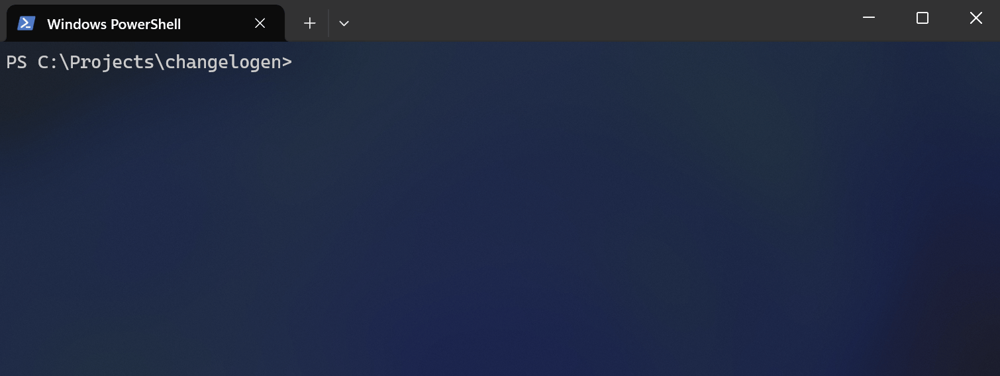

<h1 align="center">
  <br>
    
  <br><br>
  Git CLI Utils
  <br>
  <br>
</h1>

<h4 align="center">Interactive Git workflows with fuzzy search and smart highlighting</h4>

<p align="center">
  
  
  
</p>

Fast CLI tools for Git with **real-time search**, **fuzzy matching**, and **keyboard navigation**.

## Getting Started

**Run without installing** – get an instant overview of all available commands:

```bash
npx git-cli-utils
```

**Interactive command selector:**


**What you can do:**
- Browse all commands with descriptions
- Search commands by typing (e.g., type "branch" to filter)
- Navigate with arrow keys and execute with Enter
- No installation required – works instantly with `npx`
- Perfect for discovery – explore features without memorizing commands

## Core Features

- **Interactive Branch Search** – Find and checkout branches with fuzzy matching
- **Commit Explorer** – Search commit history with SHA copying to clipboard
- **Author Analytics** – Analyze top contributors by file or repository
- **Git Aliases** – Setup shortcuts for faster workflows
- **Smart Highlighting** – Visual feedback for exact and fuzzy matches
- **Command Discovery** – Interactive menu to explore all features
- **Configurable Editor Integration** – Configure a preferred editor and auto-open new worktrees
- **Worktree Management** – Create parallel environments from branches, commits, or remotes

## Installation and Setup

```bash
# Interactive command selector (recommended)
npx git-cli-utils

# Or run specific commands directly
npx git-cli-utils branches
npx git-cli-utils commits

# Install globally for better performance
npm install -g git-cli-utils
git-utils init  # Setup git aliases

# Configure your preferred editor for auto-opening worktrees
git-utils config editor set /usr/local/bin/code --args "--new-window"
```

**Performance Tip**: Global installation eliminates npm resolution overhead for faster git aliases.

## Interactive Search in Action

### Commit Search with Highlighting

```bash
git-utils commits
```

**Live terminal output:**
```
Search: refactor
Use arrow keys to navigate, Enter to select, Esc to clear search, Ctrl+C to exit

=> 2025-09-26 812973f - refactor: update GitExecutor tests for consistency and clarity
   2025-09-26 269c942 - refactor: format test code for better readability
   2025-09-26 fcba180 - refactor: introduce git executor to bundle git logic
   2025-09-26 e61a6e3 - refactor: simplify header formatting in authors command
   2025-09-26 f34fb8a - refactor: remove emoji from console messages for cleaner output
   2025-09-26 e548156 - refactor: update import paths for core modules to relative paths
   2025-09-24 124f2d5 - refactor: replace ANSI utility with color helper functions
   2025-09-24 0452026 - chore: refactor import paths and add ANSI utility for improved UI
   2025-09-18 bf9378d - fix: read version dynamically from package.json instead of hardcoded value
   2025-09-17 d7f16f6 - chore: migrate to Bun native testing framework with TypeScript

↓ More items below
```

**What happens:**
- Type `refactor` → instantly filters to matching commits
- **Exact matches** highlighted with **magenta background**
- **Fuzzy matches** highlighted with **cyan background**
- Selected item shows **green background**
- Press Enter → copies `812973f` to clipboard

### Branch Search Examples

```bash
git-utils branches
```

**Exact matching:**
```
Search: feature
=> feature/user-authentication    2 days ago
   feature/payment-integration    5 days ago
   feature/dashboard-redesign     1 week ago
```

**Fuzzy matching:**
```
Search: fdb
=> feature/dashboard-redesign     1 week ago
   fix/dashboard-bug             3 days ago
```
*Matches: **f**eature/**d**ash**b**oard and **f**ix/**d**ash**b**oard*

**Smart ranking:**
```
Search: auth
=> feature/user-authentication    2 days ago    (exact match wins)
   oauth-integration             1 week ago     (fuzzy match)
   feature/author-analytics      2 weeks ago    (fuzzy match)
```

### Command Discovery

```bash
npx git-cli-utils  # Start with the interactive selector
```

**Type to search commands:**
```
Search: author
=> authors      Show top contributors by commit count, optionally for a specific file
```

**Then explore author analytics:**
```bash
npx git-cli-utils authors
npx git-cli-utils authors src/file.ts  # File-specific analysis
```

```
Search: john
=> John Doe <john@example.com>        42 commits
   Johnny Smith <j.smith@email.com>   38 commits
   Johnson Wilson <wilson@dev.co>     15 commits
```

### Git Aliases Setup

```bash
git-utils init
```

**Interactive setup:**
```
Search Branches → git branches
Search Commits → git commits
Search Stashes → git stashes
Save Changes → git save
Top Authors → git authors

Now use:
  git branches  - Search and checkout branches
  git commits   - Search commits (copies SHA)
  git stashes   - Browse and manage stashes
  git save      - Quick stash current changes
  git authors   - View top contributors
```

## Available Commands

### Interactive Mode (Recommended)
```bash
npx git-cli-utils  # Shows command selector with search
```

### Command Reference

| Command | Description | Usage | Git Alias |
|---------|-------------|-------|-----------|
| `branches` | Interactive branch finder with checkout | `npx git-cli-utils branches` | `git branches` |
| `commits` | Interactive commit explorer with enhanced diff view | `npx git-cli-utils commits` | `git commits` |
| `stashes` | Interactive stash manager with actions | `npx git-cli-utils stashes` | `git stashes` |
| `save` | Save working directory changes as stash | `npx git-cli-utils save` | `git save` |
| `authors` | Show top contributors by commits | `npx git-cli-utils authors [file]` | `git authors` |
| `init` | Setup git aliases interactively | `npx git-cli-utils init` | - |
| `aliases` | Browse and execute git aliases | `npx git-cli-utils aliases` | - |
| `worktrees` | Manage existing git worktrees | `npx git-cli-utils worktrees` | - |
| `config` | Manage git-cli-utils configuration (editor, etc.) | `npx git-cli-utils config` | - |

## Editor Integration

Configure your preferred editor for automatic worktree opening:

```bash
git-utils config
```

**Interactive configuration:**
1. Select scope (currently only `editor`)
2. Choose action: `Show current editor` or `Set / change editor`
3. Enter binary path and optional arguments

**Direct configuration:**

```bash
git-utils config editor set /usr/local/bin/code --args "--new-window"
git-utils config editor show
```

Configuration is stored in `~/.git-cli-utils/config.json`.

**Editor Examples:**

| Editor | Command |
|--------|---------|
| VS Code | `git-utils config editor set $(which code) --args "--new-window"` |
| JetBrains (WebStorm) | `git-utils config editor set /Applications/WebStorm.app/Contents/MacOS/webstorm` |
| Sublime Text | `git-utils config editor set /Applications/Sublime\ Text.app/Contents/SharedSupport/bin/subl --args "-n"` |
| Windows VS Code | `git-utils config editor set "C:/Program Files/Microsoft VS Code/Code.exe" --args "--new-window"` |

## Worktrees Workflow

Create parallel working environments without switching branches:

| Action | Source Command |
|--------|----------------|
| Create from branch | `git-utils branches` → select → "Open in editor" |
| Create from commit | `git-utils commits` → select → "Open in editor" |
| Create from remote branch | `git-utils remotes` → show branches → select → "Open in editor" |
| Manage existing | `git-utils worktrees` |

**Automatic Path Generation:**
- Branch worktrees: `../project-name-branch-name` (sanitized)
- Commit worktrees: `../project-name-abc12345` (8-char hash)
- Remote branch worktrees: `../project-name-origin-feature-branch`

**Note:** Removing a worktree only deletes its directory. Branches and commits remain intact.


## Contributing

Found a bug or want a feature? **Contributions welcome!** See [CONTRIBUTING.md](CONTRIBUTING.md) for development setup and guidelines.

## License

MIT © [Philipp Kief](https://github.com/PKief)

---

<p align="center">
  <strong>Made for Git productivity</strong><br>
  <a href="https://github.com/PKief/git-cli-utils">Star on GitHub</a> •
  <a href="https://www.npmjs.com/package/git-cli-utils">View on npm</a>
</p>
